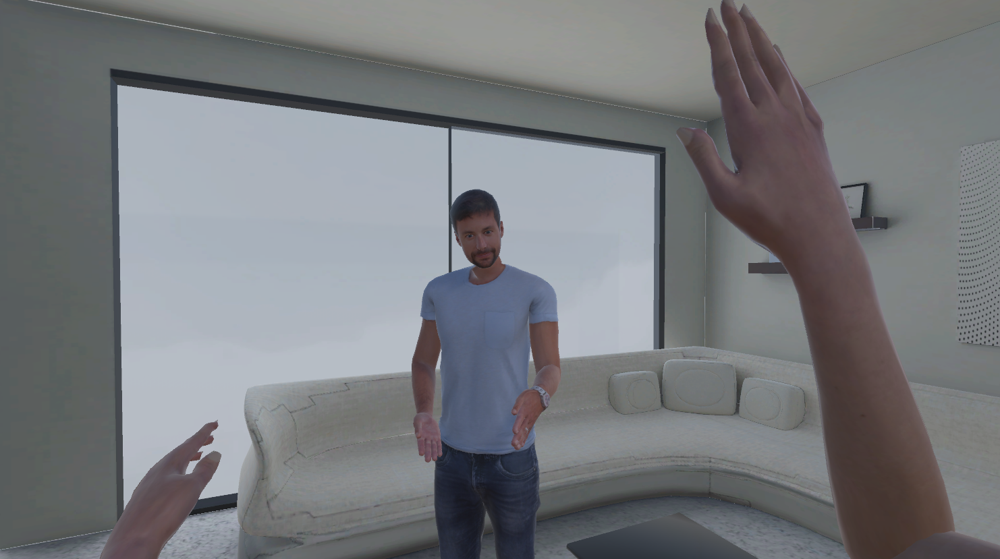
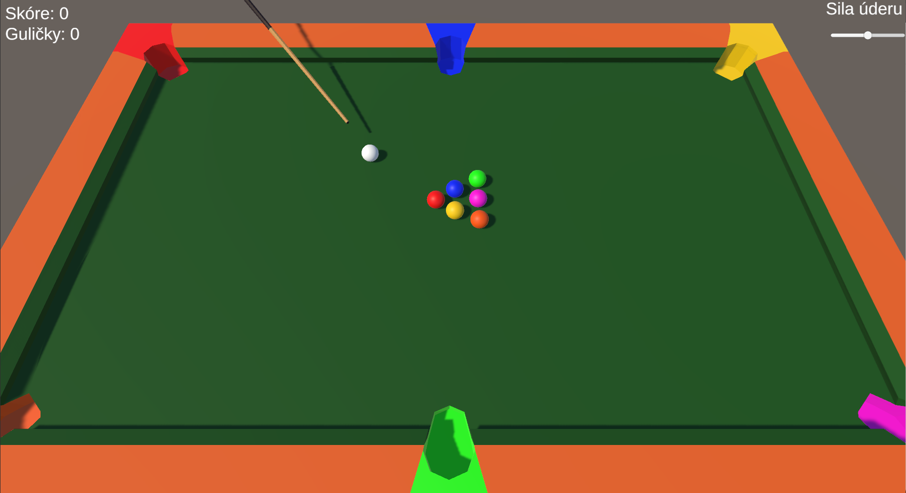
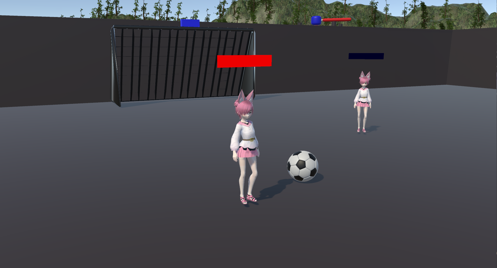
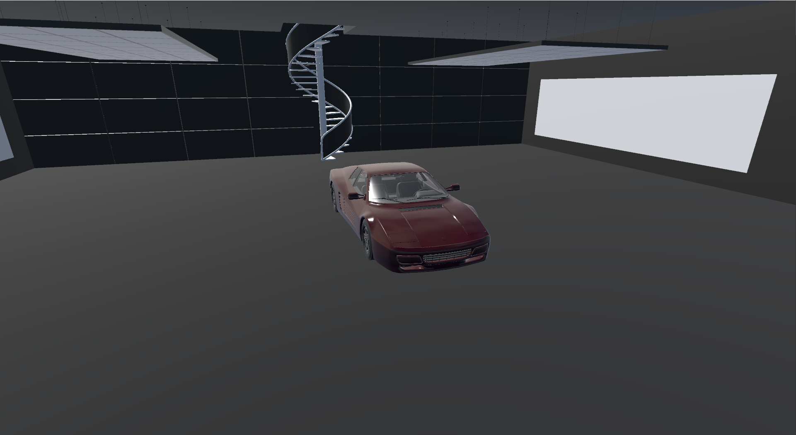

Niektoré projekty v Unity

| Náhľad | Projekt | Popis |
|--------|---------|-------|
|  | **VR komunikačná aplikácia** 🔗 <https://github.com/patriksebo/vr-client> | Aplikácia pre komunikáciu a kolaboráciu vo virtuálnej realite pre viacerých používateľov. Možnosť nahrať si a používať vlastného avatara, voľba prostredia, pohyb a komunikácia hlasom, chatom a gestami. |
|  | **Billiard** 🔗 <https://github.com/patriksebo/billiard> | Jednoduchý interaktívny biliard. |
|  | **Miny hry pre viacerých hráčov** 🔗 <https://github.com/patriksebo/minigames> | Zbierka drobných hier pre viacerých hráčov - tímovo alebo individuálne, napr. futbal, prepadávajúca sa podlaha, wipeout a ďalšie. |
|  | **3D vizualizácia auta** 🔗 <https://github.com/patriksebo/car-visualization> | Interaktívna vizualizácia auta. |
